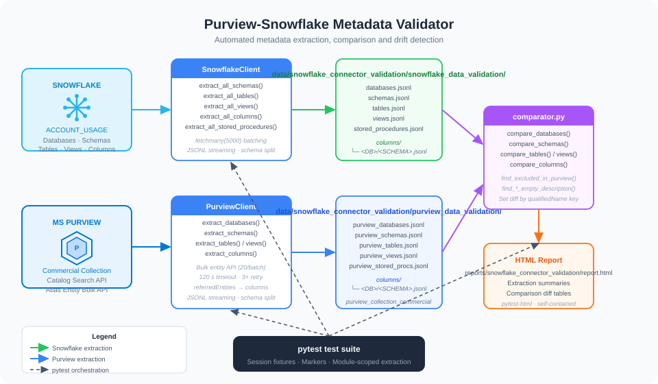

# Architecture

This document explains the internal design of **purview-snowflake-validator** — how the code is structured, how data flows through the system, and the key design decisions behind each component.



---

## High-Level Overview

The framework is a **non-browser, pytest-based integration test suite** that operates in three sequential phases during a single test session:

```
Phase 1 — Extract      →   Phase 2 — Validate      →   Phase 3 — Compare
(Snowflake + Purview)       (per-source tests)            (cross-source diff)
```

Each phase writes JSONL files to disk. Later phases read from those files, so the phases are decoupled — you can re-run only the comparison phase without re-fetching data from the cloud, provided the JSONL files are still present.

> **Note:** The session-scoped `clear_results` fixture in `conftest.py` wipes both `data/snowflake_connector_validation/snowflake_data_validation/` and `data/snowflake_connector_validation/purview_data_validation/` at the **start** of every full test session. This guarantees that each run reflects the current state of both systems.

---

## Component Breakdown

### `conftest.py` — Session Fixtures and Report Hooks

The central orchestration file. It provides three session-scoped fixtures:

| Fixture | Scope | Purpose |
|---------|-------|---------|
| `clear_results` | session, autouse | Wipes both data directories before any test runs |
| `snowflake_client` | session | Constructs and yields a `SnowflakeClient`; closes the connection after the session |
| `purview_client` | session | Constructs and yields a `PurviewClient` |
| `exclude_databases` | session | Reads `SNOWFLAKE_EXCLUDE_DATABASES` from the environment; shared by both clients and the excluded-objects test |

It also registers `pytest-html` hooks to inject custom CSS and set the report title.

---

### `clients/snowflake_client.py` — Snowflake Extraction

Wraps the `snowflake-connector-python` library and provides a streaming extraction interface.

#### Key design decisions

**`ACCOUNT_USAGE` over `INFORMATION_SCHEMA`**

All bulk extractions query `SNOWFLAKE.ACCOUNT_USAGE.*` views rather than per-database `INFORMATION_SCHEMA`. This means:
- A single query covers all databases (no per-DB loop needed).
- The exclude-list is injected as a SQL `NOT IN` clause via `_exclude_clause()`.
- There is a replication lag of up to 3 hours, but the counts are authoritative.

**Streaming via `fetchmany()`**

The `_stream()` generator fetches rows in batches of `_BATCH_SIZE = 5,000`, writing them to disk incrementally. The full result set is never loaded into memory.

**Per-schema column splitting**

`extract_all_columns()` uses `_stream_to_jsonl_by_schema()` to write one JSONL file per `<DATABASE>/<SCHEMA>` combination under `data/snowflake_connector_validation/snowflake_data_validation/columns/`. This avoids creating a single multi-gigabyte file for large warehouses.

---

### `clients/purview_client.py` — Purview Extraction

Communicates with two distinct Purview APIs:

| API | Used for |
|-----|----------|
| `POST /catalog/api/search/query` | Paginated search for databases, schemas, tables, views, stored procedures |
| `GET /catalog/api/atlas/v2/entity/bulk` | Batch-fetch of full entity objects including `referredEntities` (used for columns) |
| `GET /account/collections` | Resolving the Commercial collection's machine reference name |

#### Collection resolution

The framework looks up the machine reference name (`r0kfan`, etc.) of the Commercial collection at startup by calling `/account/collections`, then filtering by `friendlyName == Commercial` whose parent has `friendlyName == Prod`. This reference name is cached for the lifetime of the client object.

#### Why columns use a different API

The Purview Search API only surfaces **indexed** entities. Columns (`snowflake_table_column`, `snowflake_view_column`) have `isIndexed: false` in Purview's data model — they live as `referredEntities` inside their parent table/view entity. The framework:

1. Collects all table + view GUIDs from the search results.
2. Batch-fetches 20 GUIDs at a time via the Atlas `entity/bulk` endpoint with `minExtInfo=true`.
3. Extracts every `referredEntity` whose `typeName` is in `_COLUMN_TYPES`.
4. Parses `database_name` / `schema_name` / `table_name` from the `qualifiedName` field.

**Resilience**: Each bulk request has a 120-second timeout. On `ConnectionError`, `ChunkedEncodingError`, or `ReadTimeout`, the client waits `2^attempt` seconds, refreshes the `requests.Session`, and retries up to 3 times.

---

### `utils/comparator.py` — Diff Engine

Provides pure functions for loading JSONL data and computing set differences.

#### Key functions

| Function | Purpose |
|----------|---------|
| `load_jsonl(path)` | Load a single JSONL file into a list of dicts |
| `load_jsonl_dir(dir_path)` | Recursively load all `.jsonl` files under a directory |
| `parse_qualified_name(qn)` | Extract `database`, `schema`, `table`, `view`, `column` from a Purview `qualifiedName` URI |
| `diff_sets(sf, pv, sf_key, pv_key)` | Return `(missing_from_purview, extra_in_purview)` as sorted key lists |
| `compare_*(actual_dir, expected_dir)` | Per-entity convenience wrappers for `diff_sets` |
| `find_excluded_in_purview(expected_dir, excluded_dbs)` | Scan Purview JSONL files for any record whose `qualifiedName` references an excluded database |

#### Comparison keys

Each entity type has a natural key derived from its fully-qualified name:

| Entity | Snowflake key | Purview key |
|--------|--------------|-------------|
| Database | `DATABASE_NAME` | Parsed from `qualifiedName` → `/databases/<DB>` |
| Schema | `DATABASE_NAME.SCHEMA_NAME` | Parsed from `qualifiedName` |
| Table | `TABLE_CATALOG.TABLE_SCHEMA.TABLE_NAME` | Parsed from `qualifiedName` |
| View | `TABLE_CATALOG.TABLE_SCHEMA.TABLE_NAME` | Parsed from `qualifiedName` |
| Column | `TABLE_CATALOG.TABLE_SCHEMA.TABLE_NAME.COLUMN_NAME` | Parsed from `qualifiedName` |

All keys are uppercased before comparison to avoid case-sensitivity false positives.

---

### `utils/html_extras.py` — Report Builder

Generates styled HTML fragments that are embedded into individual test results via the `pytest-html` `extra` fixture.

| Function | Purpose |
|----------|---------|
| `make_table(headers, rows, title)` | Generic styled HTML table; truncates at 500 rows by default |
| `make_diff_report(entity_type, missing, extra, ...)` | Combined diff summary box + two tables (missing / extra) |
| `make_excluded_report(found)` | One table per leaking entity type |
| `make_empty_description_report(records, source)` | Table of columns with empty descriptions |

All output is escaped via `_esc()` to prevent XSS in the HTML report.

---

### Test Files — pytest Suite

Tests are organised by entity type and execution phase:

#### Naming convention

| Prefix | Phase | Description |
|--------|-------|-------------|
| `test_<entity>.py` | Phase 1 & 2 | Extract from Snowflake and validate |
| `test_purview_<entity>.py` | Phase 1 & 2 | Extract from Purview and validate |
| `test_z_comparison.py` | Phase 3 | Cross-source diff (runs last — `z_` prefix) |
| `test_z_excluded_objects.py` | Phase 3 | Excluded-DB guard (runs last) |

#### Fixture scope

All extraction fixtures are `scope="module"`. The `SnowflakeClient` and `PurviewClient` themselves are `scope="session"`, so a single Snowflake connection and a single token are reused across the entire run.

---

## Data Flow (Step by Step)

```
pytest session starts
│
├─ clear_results (autouse)
│   └─ wipes data/snowflake_connector_validation/snowflake_data_validation/ and data/snowflake_connector_validation/purview_data_validation/
│
├─ SNOWFLAKE EXTRACTION (test_*.py)
│   ├─ SnowflakeClient connects (session-scoped)
│   ├─ extract_all_schemas()        → data/snowflake_connector_validation/snowflake_data_validation/snowflake_schemas.jsonl
│   ├─ extract_all_tables()         → data/snowflake_connector_validation/snowflake_data_validation/snowflake_tables.jsonl
│   ├─ extract_all_views()          → data/snowflake_connector_validation/snowflake_data_validation/snowflake_views.jsonl
│   ├─ extract_all_columns()        → data/snowflake_connector_validation/snowflake_data_validation/columns/<DB>/<SCHEMA>.jsonl
│   └─ extract_all_stored_procedures() → data/snowflake_connector_validation/snowflake_data_validation/snowflake_stored_procedures.jsonl
│
├─ PURVIEW EXTRACTION (test_purview_*.py)
│   ├─ PurviewClient resolves Commercial collection ref (cached)
│   ├─ _search('snowflake_database') → data/snowflake_connector_validation/purview_data_validation/purview_databases.jsonl
│   ├─ _search('snowflake_schema')   → data/snowflake_connector_validation/purview_data_validation/purview_schemas.jsonl
│   ├─ _search('snowflake_table')    → data/snowflake_connector_validation/purview_data_validation/purview_tables.jsonl
│   ├─ _search('snowflake_view')     → data/snowflake_connector_validation/purview_data_validation/purview_views.jsonl
│   └─ bulk entity fetch (tables+views) → data/snowflake_connector_validation/purview_data_validation/columns/<DB>/<SCHEMA>.jsonl
│
├─ COMPARISON (test_z_comparison.py)
│   ├─ load_jsonl() / load_jsonl_dir() from both sides
│   ├─ diff_sets() per entity type
│   └─ make_diff_report() → embedded in HTML report
│
├─ EXCLUDED-DB GUARD (test_z_excluded_objects.py)
│   └─ find_excluded_in_purview() → fail if any leak detected
│
└─ pytest-html generates reports/snowflake_connector_validation/report.html
```

---

## Extension Points

| What you want to do | Where to look |
|---------------------|---------------|
| Add a new Snowflake entity | `clients/snowflake_client.py` + new test file |
| Add a new Purview entity | `clients/purview_client.py` (`_ENTITY_TYPES`) + new test file |
| Change comparison key logic | `utils/comparator.py` key extractor functions |
| Customise the HTML report style | `utils/html_extras.py` `_STYLE` constant + `conftest.py` CSS hook |
| Change retry / timeout behaviour | Constants at the top of `clients/purview_client.py` |
| Change batch sizes | `_BATCH_SIZE` (search pagination) and `_ENTITY_BULK_SIZE` (bulk entity fetch) |
